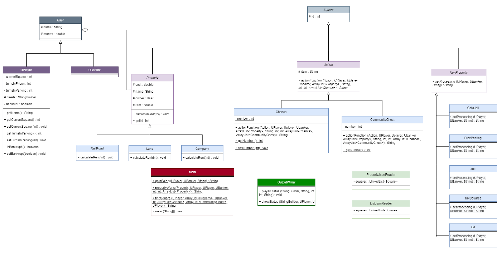

///////////// COMPILATION ////////////// 
javac *.java

///////////////// RUN ///////////////// 
java Main

Here is the UML diagram for my code:

italicized the classes and methods that have been defined as abstract.
underlined the attributes and methods that have been set as static.
