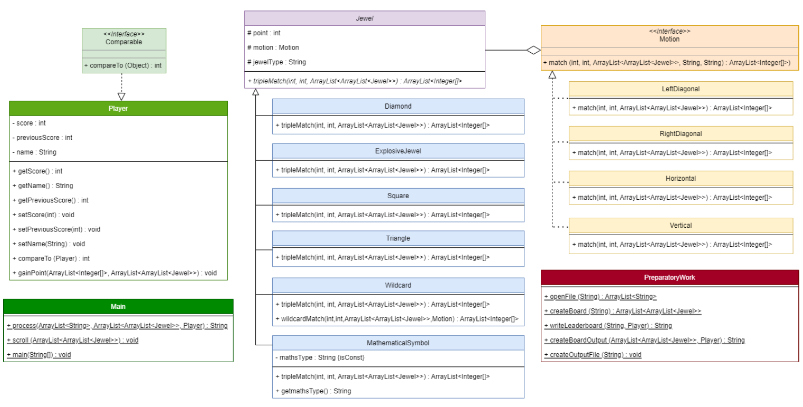

///////////// COMPILATION ////////////// 
javac *.java

///////////////// RUN ///////////////// 
java Main

italicized the classes and methods that have been defined as abstract.
underlined the attributes and methods that I have been set as static.
written “{isConst}” next to the final attribute that have been specified.
